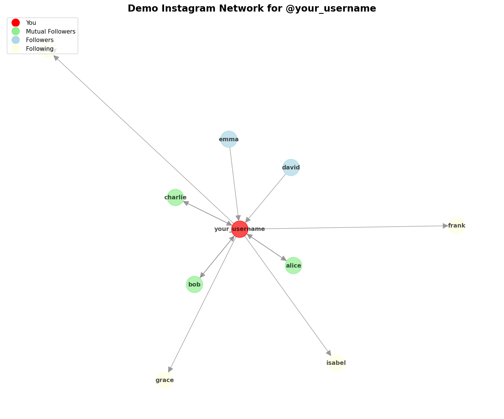

# Instagram Epic Tool 🔍📊

Exploring Instagram networks through graph visualisation. A Python-based tool for analyzing followers, unfollowers, and visualizing your Instagram network as an interactive graph.

## ⚠️ Disclaimer

This tool is developed for **educational and personal use only**, without malicious intent. It uses Instagram's API through the `instagrapi` library. Use responsibly and respect Instagram's Terms of Service.

## ✨ Features

- 📊 **Network Visualization**: Display your followers and following as a beautiful graph where each person is a node
- 🔍 **Unfollowers Detection**: See who doesn't follow you back
- 👥 **Fans Analysis**: Find people who follow you but you don't follow back
- 🤝 **Mutual Followers**: Identify mutual follower relationships
- 📈 **Statistics**: Get detailed statistics about your Instagram network
- 💾 **Export Data**: Save follower/following data to JSON files for further analysis

## 🚀 Installation

1. Clone this repository:
```bash
git clone https://github.com/Diegodepab/instagram-epic-tool.git
cd instagram-epic-tool
```

2. Install required dependencies:
```bash
pip install -r requirements.txt
```

3. Create your configuration file:
```bash
cp config.env.example config.env
```

4. Edit `config.env` and add your Instagram credentials:
```
INSTAGRAM_USERNAME=your_username_here
INSTAGRAM_PASSWORD=your_password_here
```

## 📖 Usage

### Demo Mode

Try the tool without Instagram credentials to see how it works:
```bash
python demo.py
```

This will generate a `demo_instagram_network.png` file showing an example network visualization.

### Basic Commands

**Visualize your network as a graph:**
```bash
python main.py --visualize
```

**Analyze your followers and following:**
```bash
python main.py --analyze
```

**Find users who don't follow you back:**
```bash
python main.py --unfollowers
```

**Find your fans (people you don't follow back):**
```bash
python main.py --fans
```

**Show mutual followers:**
```bash
python main.py --mutual
```

### Combined Commands

**Do everything - analyze and visualize:**
```bash
python main.py --visualize --analyze --unfollowers --fans --mutual
```

**Save data to JSON files:**
```bash
python main.py --analyze --save-data
```

**Custom output file for visualization:**
```bash
python main.py --visualize --output my_network.png
```

## 📊 Graph Visualization

The network graph uses different colors to represent different types of relationships:

- 🔴 **Red**: You (the central node)
- 🟢 **Green**: Mutual followers (follow each other)
- 🔵 **Blue**: Your followers
- 🟡 **Yellow**: People you follow

Arrows indicate the direction of the follow relationship.

### Example Output



*Example visualization showing a user's Instagram network with followers, following, and mutual connections.*

## 🗂️ Output Files

When you run the tool with `--save-data`, it generates the following JSON files:

- `followers.json`: List of all your followers
- `following.json`: List of all people you follow
- `unfollowers.json`: Users who don't follow you back
- `fans.json`: Users you don't follow back
- `mutual_followers.json`: Mutual follower relationships

## 🛠️ Project Structure

```
instagram-epic-tool/
├── main.py                 # Main CLI interface
├── instagram_client.py     # Instagram API client
├── analyzer.py            # Follower analysis logic
├── visualizer.py          # Network graph visualization
├── demo.py                # Demo script (no credentials needed)
├── requirements.txt       # Python dependencies
├── config.env.example     # Example configuration file
└── README.md             # This file
```

## 🤝 Contributing

Contributions are welcome! Please feel free to submit a Pull Request.

## 📄 License

This project is licensed under the MIT License - see the LICENSE file for details.

## 🙏 Acknowledgments

Inspired by:
- [davidarroyo1234/InstagramUnfollowers](https://github.com/davidarroyo1234/InstagramUnfollowers)
- [natrixdev/instagram-botter](https://github.com/natrixdev/instagram-botter)

## ⚙️ Technical Details

This tool uses:
- `instagrapi` for Instagram API access
- `networkx` for graph creation and analysis
- `matplotlib` for graph visualization
- `python-dotenv` for configuration management

## 🐛 Troubleshooting

**Login Issues:**
- Make sure your credentials are correct in `config.env`
- Instagram may require 2FA - you might need to disable it temporarily
- If you get rate limited, wait a few minutes before trying again

**Visualization Issues:**
- If the graph looks cluttered with many followers, the tool automatically handles layout
- Try adjusting the figure size in the code if needed

**Data Collection:**
- Large accounts may take longer to fetch all followers/following
- Be patient and let the tool complete
