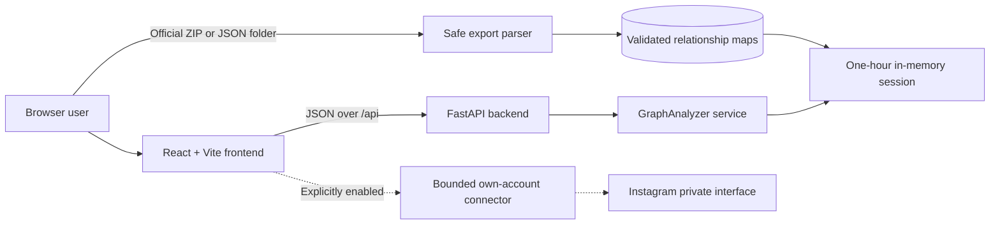
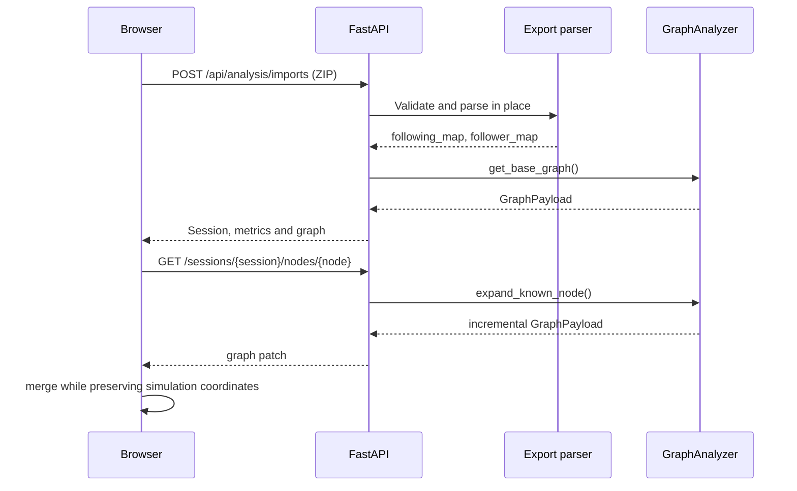

# Project Architecture

## Overview

CircleScope primarily analyzes official Instagram GDPR exports and visualizes relationships from user-authorized datasets without external calls. A separately gated laboratory connector can make bounded requests for the authenticated account only; it is disabled by default and is not part of the normal analysis flow.

## Components



### Frontend

`src/frontend/` is a React single-page application. API transport lives in `src/services`, response and visualization contracts in `src/types`, graph state and merge behavior in `src/hooks`, and rendering in `src/components`. During development, Vite proxies `/api` to FastAPI, avoiding environment-specific URLs and browser CORS differences.

### Backend

`src/backend/` is a FastAPI application organized by responsibility:

- `infrastructure/instagram_export_reader.py` owns ZIP safety, member discovery, raw JSON validation, and defensive username extraction.
- The reader also retains the earliest timestamp associated with each directional relationship when Meta includes it.
- Temporary sessions merge multiple consented exports atomically and track imported owners plus per-edge provenance.
- `domain/models.py` defines strict raw and graph Pydantic models.
- `domain/relationship_service.py` owns set mathematics and the `nodes`/`links` graph projection.
- `application/instagram_import_service.py` coordinates extraction and domain operations without HTTP concerns.
- `api/routers` translates HTTP requests and errors.
- `services/session_store.py` holds short-lived analysis sessions.
- `utils/zip_parser.py` is a backward-compatible facade and contains no extraction rules.

The dependency direction is API → application → domain/infrastructure. Infrastructure produces normalized identities; it does not categorize relationships or build graph nodes.

### Isolated laboratory

`api/routers/lab_api.py` exposes integration status, a bounded own-account operation and a defensive static assessment. `services/lab_integrations.py` enforces the feature flag, consent, identity match, quotas, cooldown and non-persistence. The `Instagram-` source is parsed as text and is never imported or executed.

### Export parser

The parser accepts a ZIP archive, ZIP bytes, a binary stream, or an already extracted directory. It reads JSON in place and never extracts archive contents. It rejects traversal paths, symbolic links, encrypted archives, excessive file counts, oversized content, suspicious compression ratios, malformed JSON, and HTML-only exports.

An Instagram export contains the direct relationships of the account that generated it. It does not contain every other account's complete social graph. Consequently, lazy expansion may only traverse edges already present in the authorized dataset. Future support for multiple exports can merge independently authorized ego networks without external lookups.

## API Flow



For clients that need a direct react-force-graph payload, `POST /api/analysis/imports/graph` returns strict `GraphData`:

```json
{
  "nodes": [{ "id": "owner", "username": "@owner", "group": 0 }],
  "links": [{ "source": "owner", "target": "another_user" }]
}
```

Node groups are `0` central profile, `1` mutual, `2` fan, and `3` non-follower. Fan links point toward the central profile; followed and mutual links point outward from it.

## Technologies

- Web: React 19, TypeScript, Vite, react-force-graph
- API: Python, FastAPI, Pydantic
- Export processing: Python standard library (`zipfile`, `json`)
- Release management: Conventional Commits and release-please

## Design Decisions

- API-only types use TypeScript `import type`; this prevents erased interfaces from becoming invalid browser imports.
- The frontend defaults to a relative `/api` URL. `VITE_API_BASE_URL` is only needed when API and web are hosted separately.
- Expansion returns incremental graph patches rather than the complete graph to limit payload size.
- Existing force-simulation coordinates are preserved when node data is merged, avoiding visual jumps.
- Uploaded archives are parsed without extraction and are not persisted by the extractor.
- Usernames are normalized and validated before becoming graph identifiers.
- The existing MIT license is retained as an explicit project decision; changing a license requires owner review.

## Development and Deployment

Local development uses two processes: FastAPI on port 8000 and Vite on port 5173. CI builds the frontend and executes Python tests. In accordance with the organizational guide, a deployment must be validated in the private `Apolo_Dev` environment before production; concrete infrastructure details are intentionally not stored in this repository.
